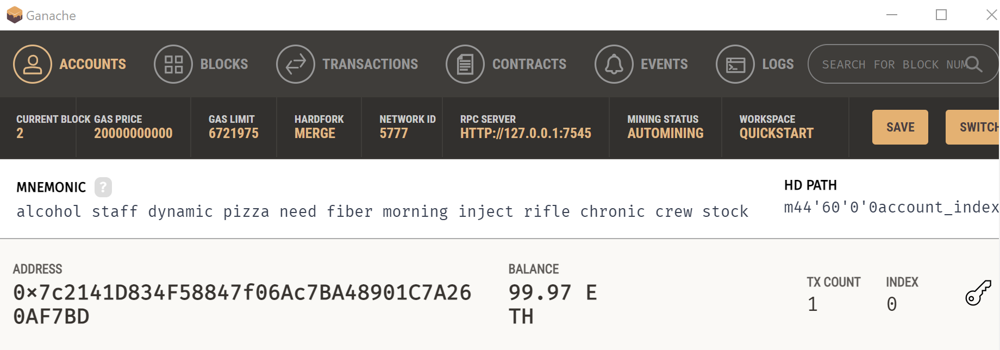
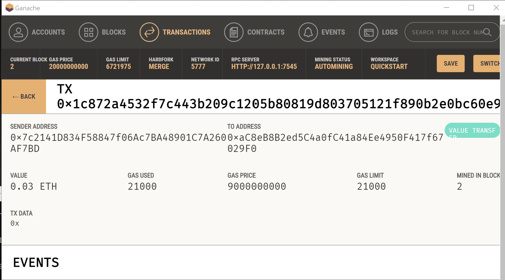

# Fintech Finder - Blockchain Platform

You work at a startup that is building a new and disruptive platform called Fintech Finder. Fintech Finder is an application that its customers can use to find fintech professionals from among a list of candidates, hire them, and pay them. As Fintech Finder’s lead developer, you have been tasked with integrating the Ethereum blockchain network into the application in order to enable your customers to instantly pay the fintech professionals whom they hire with cryptocurrency.

In this Challenge, you will complete the code that enables your customers to send cryptocurrency payments to fintech professionals. To develop the code and test it out, you will assume the perspective of a Fintech Finder customer who is using the application to find a fintech professional and pay them for their work.

## Technologies

Programming Languages: Python 3.7.13 

Libraries: 
- Pandas - a Python library that is used for data manipulation, analysis, and visualization. 
- Streamlit - an open-source Python library that is designed to create custom web applications for machine learning and data science projects. It allows you to turn your data scripts into interactive web applications with just a few lines of code, making it easier to share and visualize your results with others.
- Web3.py: A Python library for connecting to and performing operations on Ethereum-based blockchains.
- Ethereum-tester: A Python library that provides access to the tools used to test Ethereum-based applications.
- Mnemonic: A Python implementation for generating a 12- or 24-word mnemonic seed phrase based on the BIP-39 standard.
- Bip44: A Python implementation for deriving hierarchical deterministic wallets from a seed phrase based on the BIP-44 standard.

Operating System(s):  Any operating system that supports Python, including Windows & macOS.

## Installation Guide

To run this analysis, make sure you install the necessary dependencies:

1. Install Python: https://www.python.org/downloads/
2. Clone the repository: git clone "https://github.com/mikenguyenx/19_fintech_blockchain_platform.git" using git or download the ZIP file and extract it to a local directory.
3. Install the Streamlit library by running the following command:
```
pip install streamlit
```
4. Ensure Ganache is installed on your computer. Once installed, create a new workspace and copy the mnemonic. Paste the mnemonic in the MNEMONIC variable in the .env file.

## Usage

1. Open a terminal or command prompt and navigate to the directory with the python file.
2. In the terminal, run the Streamlit application by using streamlit run fintech_finder.py.
```
streamlit run fintech_finder.py 
```
3. On the resulting webpage, select a candidate that you would like to hire from the appropriate drop-down menu. Then, enter the number of hours that you would like to hire them for. (Remember, you do not have a lot of ether in your account, so you cannot hire them for long!)
4. Click the Send Transaction button to sign and send the transaction with your Ethereum account information. Navigate to the Transactions section of Ganache.






## Contributors

Mike Nguyen

## License

GNU General Public License v3.0